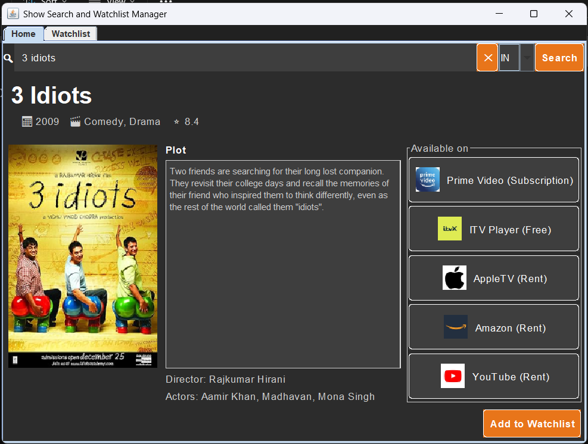
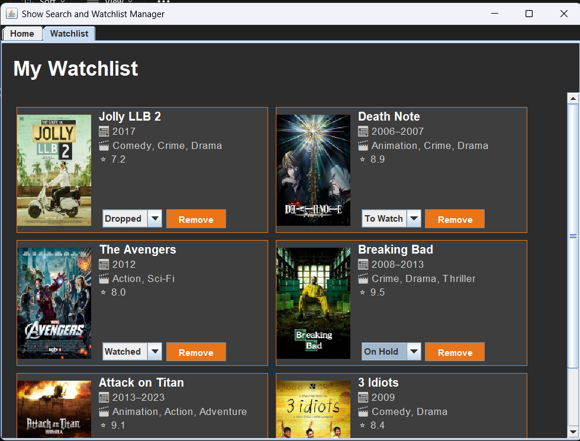

# Movie Manager

## Overview

A simple movie search and watchlist manager application built with Java and Swing. This application allows users to search for movies, view their details, and manage a personal watchlist. It utilizes several APIs to fetch movie data, trending shows, and streaming information.

## Preview

### Search Page

### Watchlist Page

## Features

- **Movie Search:** Search for movies by title and view detailed information, including poster, plot, director, actors, and IMDb rating.
- **Streaming Information:** Find out where to stream movies online with information from various streaming services.
- **Watchlist Management:**
    - Add movies to your personal watchlist.
    - View your watchlist in a modern card-based layout.
    - Change the status of each movie in your watchlist (e.g., "To Watch", "Watched", "On Hold", "Dropped").
    - Remove movies from your watchlist.

## API Usage

This application uses the following APIs:

- **OMDB API:** Used to fetch detailed movie information, such as plot, director, actors, and IMDb rating, based on a movie title search.
- **TMDb API:** Used to fetch a list of trending shows, which are displayed on the home screen of the application.
- **Watchmode API:** Used to find out where to stream movies online. It provides information about which streaming services (e.g., Netflix, Hulu, Amazon Prime) offer a particular movie for streaming, rental, or purchase.
- **logo.dev API:** Used to get the logos of the OTT platforms.

## Technologies Used

- Java
- Swing (for the UI)
- SQLite (for the database)
- OMDB API (for movie data)
- TMDb API (for trending shows)
- Watchmode API (for streaming information)
- logo.dev API (for OTT platform logos)
- Gson (for parsing JSON)
- java-dotenv (for managing environment variables)
  
